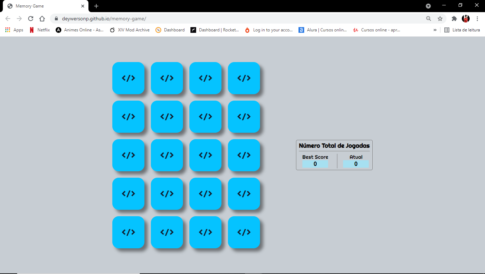

<h1 align="center">
 Memory Game
</h1>

  <a href="#-project">Project</a>&nbsp;&nbsp;&nbsp;|&nbsp;&nbsp;&nbsp;
  <a href="#-technologies">Technologies</a>&nbsp;&nbsp;&nbsp;|&nbsp;&nbsp;&nbsp;
  <a href="#-services-used">Services Used</a>&nbsp;&nbsp;&nbsp;|&nbsp;&nbsp;&nbsp;
  <a href="#-getting-started">Getting Started</a>&nbsp;&nbsp;&nbsp;|&nbsp;&nbsp;&nbsp;
  <a href="#-how-to-use">How To Use</a>&nbsp;&nbsp;&nbsp;|&nbsp;&nbsp;&nbsp;
  <a href="#-features">Features</a>&nbsp;&nbsp;&nbsp;

 

 

  

## 💻 Project

Memory Game is a project developed with the same objective as a standard memory game. 

 

This application is hosted on GitHub Pages, [click here to see it](https://deywersonp.github.io/memory-game/).

  

## 🚀 Technologies

This project was developed using these techs:

- [HTML](https://developer.mozilla.org/pt-BR/docs/Web/HTML)
- [CSS](https://developer.mozilla.org/pt-BR/docs/Web/CSS)
- [JavaScript](https://developer.mozilla.org/pt-BR/docs/Web/JavaScript)

 

## 👨‍🔧 Services Used

- GitHub
- [GitHub Pages](https://pages.github.com/)

 

## 🎮 Getting Started

If you want run this code, you can start cloning the repository using HTTP or SSH key.

- Open your git
- Type `git clone`
- Insert the HTTP or SSH key (on windows, shift + insert to paste on gitBash)
- You can find this HTTP or SSH Key by clicking on `Code` on the top right in this repository

- Once cloned you can open the project in your IDE and open the archive `index.html` on your browser.

  

## 📌 How to Use

### 1 - When you access the project, you will see the home page

### 2 - On this page you can turn over up to two cards: if they are paired, they remain turned over; otherwise, both are turned face down again.
#### 2.1 - Every two cards flipped, the current score value is increased by 1.

### 3 - Once all pairs are formed, the endgame modal will be displayed!

### 4 - In the new game, the total value of the plays will be attributed to your best score. If the amount of current score is higher compared to the best score, the current score will be red, but you can keep playing.

### Invite friends and see who can finish the game with the fewest moves!
 
 

## 🕵 Features

The main features of the application are:

 - Flip cards
 - Game Over / Restart Game
 - Best Score
 - Current Score
 
 

 > In case of sensitive bugs like security vulnerabilities, please contact
 > <a href = "mailto:deywerson.pereira@gmail.com">deywerson.pereira@gmail.com</a> directly instead of using issue tracker. We value your effort
 > to improve the security and privacy of this project!
  
 
---
  

      
Please follow on github and join us! Thanks for visiting me and good coding!

Made with ♥ by <a href="https://github.com/deywersonp">Deywerson Pereira</a>
